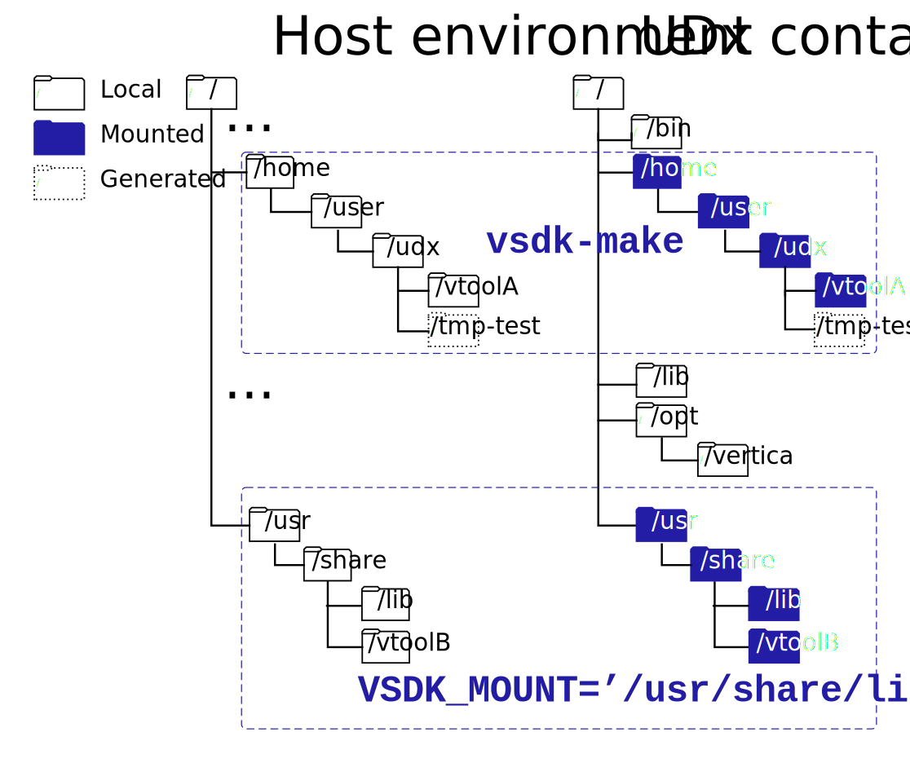

[](https://opensource.org/licenses/Apache-2.0)

# Vertica User-Defined Extensions (UDx) Container

[Vertica](https://www.vertica.com/) is a massively scalable analytics data warehouse that stores your data and performs analytics on it all in one place.

This repository creates an image that provides tools to develop C++ User-Defined Extensions (UDxs) for Vertica.

For additional details about developing Vertica UDxs, see [Extending Vertica](https://www.vertica.com/docs/latest/HTML/Content/Authoring/ExtendingVertica/ExtendingVertica.htm).

## Prerequisites
- [Docker Desktop](https://www.docker.com/get-started) or [Docker Engine](https://docs.docker.com/engine/install/).
- Vertica RPM or DEB file.
- vsql driver and other applicable [client libraries](https://www.vertica.com/download/vertica/client-drivers/).
- [Python 3](https://www.python.org/downloads/).

# Supported Platforms

Container techology provides the freedom to run environments independently of the host operating system. For example, you can run a CentOS container on an Ubuntu workstation, and vice versa.

Vertica provides a Dockerfile for different distributions so that you can create an containerized development environment that matches your production environment.

## Vertica

Vertica tests the following versions, but the contents of this repository might work with eariler versions:
- 12.x
- 11.x
- 10.x

## CentOS
- 7.9

## Ubuntu
- 20.04
- 18.04


# Overview

The Vertica UDx container packages the binaries, libraries, and compilers required to create C++ Vertica UDx extensions. Use this repository with your Vertica binary to develop UDxs on any host system that meets the [prerequisites](#prerequisites).

In addition, this repository provides `vsdk-*` commmand line tools to simplify the development process. You can develop UDxs on your host machine, compile them within the UDx container, and then save the object files on your host machine to load into Vertica.

Of special note is the `vsdk-vertica` command which launches a container with a running Vertica instance. You can use this container to load and test your UDx.

# Building the UDx container

Use the repository [Makefile](Makefile) to build your container. The Makefile requires that you store a Vertica RPM or DEB file in the top level of the UDx-container directory of your cloned repository. The container inherits the privileges and user ID from the user executing the container.

## Build variables

You can include build variables in the build process to customize the container. The following table describes the available variables:

| Name                      | Definition |
|---------------------------|------------|
| `OSTAG` | The container operating system distribution, either `centos` or `ubuntu`. This variable is required to build a container that runs an OS that is different from the host OS. |
| `PACKAGE` | When there is more than one Vertica RPM or DEB file in the top-level directory, this variable specifies which file to use in the build process. |
| `TARGET` | Required. The file type (`rpm` or `deb`) of the Vertica binary that you use in the build process. |
| `VERTICA_VERSION` | The version number of the Vertica binary used in the build process. This value is optional for a [canonically-named Vertica binary](#building-with-a-canonically-named-vertica-binary).<br> You can use this variable to build containers for different Vertica versions. |

You might build multiple containers to develop UDxs for multiple Vertica versions. To help distinguish between containers, define `OSTAG` and `VERTICA_VERSION` in the build command. If you set `OSTAG=centos` and `VERTICA_VERSION=11.0.0-0`, the full container specification is `verticasdk:centos-11.0.0-0`.

## Building with a canonically-named Vertica binary

The build process requires the Vertica version. The `Makefile` can extract this information automatically from a canonically-named RPM or DEB file in one of the following formats:

```shell
$ vertica-10.1.1-5.x86_64.RHEL6.rpm
```

```shell
$ vertica_10.0.1-5_amd64.deb
```

The `Makefile` extracts the Vertica version (10.1.1-5) and the OS distribution version (RHEL 6). If the Vertica binary uses this format, run `make` with the `TARGET` variable to build the container. For example, the following command builds a UDx container with a canonically-named RPM file:

```shell
$ make TARGET=rpm
```

## Building with variables

If the RPM or DEB file does not use the canonical-naming convention, define the `VERTICA_VERSION` variable in the make command:

```shell
$ make TARGET=deb VERTICA_VERSION=11.0.0-0
```

# Developing UDxs

This repository provides `vsdk-*` scripts to help you test and compile your UDx in a multi-environment compilation. You invoke the following scripts on your host machine, and they execute in the UDx container:

| Script&nbsp;name | Description |
|-------------|-------------|
| `vsdk-bash` | Opens a bash shell in the UDx container. This script is useful for debugging. |
| `vsdk-cp` | Invokes `cp` inside the UDx container. This is a helper script used in the `make test` command, and included because the UDx container is not writable and you might need to copy UDx files to your host for editing. |
| `vsdk-g++` | Executes the g++ compiler in the UDx container. |
| `vsdk-make` | Executes `make` in the current working directory in the UDx container. This allows you to develop UDxs locally and compile them with the tools available in the UDx container. |

`vsdk-make` is the script that you will probably
use the most often. It behaves exactly like `make`, but it compiles your files in the development environment mounted in the UDx container.

These scripts use the contents of `/etc/os-release` to determine whether the container has a `centos` or `ubuntu` tag. If your host uses a different distribution than your development environment, you can edit `vsdk-bash` directly to change the default setting. Alternatively, you can change the default interactively by defining the OSTAG [environment variable](#environment-variables) when you execute `vsdk-make`:

```shell
$ OSTAG=ubuntu vsdk-make
```

## Environment variables

Use environment variables to provide additional information to the `vsdk-*` commands. The following table defines the avaiable environment variables:

| Environment&nbsp;Variable | Definition |
|---------------------------|------------|
| `OSTAG` | The container operating system distribution, either `centos` or `ubuntu`. This variable is if you use a container that runs an OS that is different from the host OS. If you do not define this variable, `vsdk-make` reads `/etc/os-release` to determine the OS. |
| `VERTICA_VERSION` | The version number of the Vertica binary used in the build process. |
| `VSDK_ENV` | Optional file that defines environment variables for `vsdk-*` commands that run in the container. For formatting details, see [Declare default environment variables in file](https://docs.docker.com/compose/env-file/) in the Docker documentation.|
| `VSDK_MOUNT` | A list of one or more directories that you want to mount in the UDx container filesystem. To mount multiple directories, separate each path with a space. For additional details, see [Mounting additional files](#mounting-additional-files). |

## Compiling UDxs

After you [test your UDx container](#testing-the-container), you can develop UDxs in the current working directory on the host machine and compile them in the UDx container. Use the `vsdk-make` script to execute your Makefile and compile your UDx. In a new environment, `vsdk-make` mounts the same directories as the `make test` command.

The following command passes a file containing [environment variables](#environment-variables):

```shell
$ VSDK_ENV=env-vars vsdk-make
```

## Mounting additional files 

`vsdk-make` mounts the current working directory and its child directories in the container filesystem. In some circumstances, your compilation process might require additional files that are not available in the mounted directories. 

One solution is to execute `vsdk-make` in a higher directory that includes all of the necessary files. A less intrusive solution is using `VSDK_MOUNT` to mount one or more additional directories:  

```shell
$ VSDK_MOUNT='/usr/share/lib /usr/share/toolB' vsdk-make
```

The previous command mounts `/usr/share/lib` and `/usr/share/toolB` in the UDx container. `VSDK_MOUNT` mounts directories in the container in the same filesystem location as the host. Maintaining the filesystem location helps `vsdk-make` locate the files during compilation.

You can also use `VSDK_MOUNT` with the `make test` command:

```shell
$ VSDK_MOUNT='/usr/share/lib /usr/share/toolB' make test
```

## Host and container filesystem views

By default, the UDx container contains the following directories:
- `/bin`
- `/lib`
- `/opt/vertica`

To access these tools, `vsdk-make` mounts your `/home` and local UDx directory tree in the UDx container filesystem. If your build process requires files that are not available in your directory tree, you can mount additional directories with the `VSDK_MOUNT` [environment variable](#environment-variables).

The following image describes a sample filesystem for the host and the UDx container with two additional mounted directories:



In the previous diagram:
- `/home`: The host's `/home` directory.
- `/udx`: The current working directory, or the directory where the user develops and compiles UDxs from. This is the root of the UDx development directory tree. This directory tree is mounted in the container, including `/vtoolA`.
- `/tmp-test`: Directory generated by the `vsdk-test` command that contains the compiled UDxs copied from the UDx container.
- `/usr/share/lib` and `usr/share/vtoolB`: Included in this diagram to illustrate how `VSDK_MOUNT` mounts additional development tools. The following command mounts these example directories so that the build process can access its contents:
   ```shell
   $ VSDK_MOUNT='/usr/share/lib /usr/share/vtoolB' vsdk-make
   ```

# Load the UDx into a test Vertica server

## Make the UDx available to the test Vertica server

To make your UDx available to the test Vertica server, start the server in your UDx working directory. This provides the test Vertica server container a path to your UDx working directory when it starts so it can mount its current working directory. The Vertica in the container runs as `dbadmin`.


## Starting the test Vertica server

In addition to the `vsdk-make` and `vsdk-g++` tools, there is a `vsdk-vertica` command that creates a scratch Vertica server so you can test your UDx.

The UDx container itself is not writable, so it creates and mounts a Docker volume called `verticasdk-data`. It also mounts the current working directory and your home directory in the container using the same names those directories have on the host machine. In addition, `vsdk-vertica` understands the `VSDK_MOUNT` and `VSDK_ENV` environment variables described in [environment variables](#environment-variables).


## Fetching the test Vertica server startup log

`vsdk-vertica` launches a server that runs in the background in a container named `verticasdk`. The command outputs the following message:

```shell
./vsdk-vertica
Starting container...

Run
      docker logs verticasdk
to view startup progress

Don't stop container until above command prints 'Vertica is now running'
To stop:
    docker stop verticasdk

When executing outside of a VWasm container, you can connect to this vertica
using
    vsql -p 11233

If executing inside a VWasm container (where you did your Wasm development),
just 'vsql' should suffice
```

You can read the container log using the `docker logs` command:

```shell
docker logs verticasdk
```

But also note the instructions for running vsql to talk to the Vertica in the vsdk-container:

```shell
When executing outside of a VSDK container, you can connect to this vertica
using
    vsql -p 11233 -U dbadmin
```

Outside the VSDK container the Vertica port is mapped to a non-standard port (in this case, `11233`).  The `-U dbadmin` connects to Vertica as the dbadmin user.  The database does not yet have any other users defined.  The dbadmin user has a blank password in this container's database, and has permission to manipulate UDx libraries in the container's database.

## Stopping and removing the test Vertica server

When you are done using the container, use `docker stop` to stop it:

```shell
docker stop verticasdk
```
Use `docker rm` to remove it:

```shell
docker rm verticasdk
```

When you are done with the container, it is recommended that you also remove the Docker volume it mounts as a scratch database:

```shell
docker volume rm verticasdk-data
```

## Loading your UDx into the test Vertica server

When the test Vertica server is ready, you can use `vsql` to load the UDx. The following commands load the `AggregateFunctions` library and execute some functions from it:

```shell
$ cd tmp-test/examples
$ vsql -U dbadmin -f AggregateFunctions.sql
```
To view `AggregateFunctions.sql` and other example library SQL files, see `/opt/vertica/sdk/examples`.

For additional details about working with UDx libraries, see [User-Defined Extensions](https://www.vertica.com/docs/latest/HTML/Content/Authoring/ExtendingVertica/UsingUserDefinedExtensions.htm).

# Testing the container

> **NOTE**: This section describes testing the UDx container after you modified the container with any of the tools in this repository. For testing your UDx, see [Testing your UDx](#testing-your-udx).

The `make test` target calls a few `vsdk-*` scripts to test that your container was built correctly. Then, it mounts the following directories in the UDx container filesystem to replicate your local development environment:
- `/home/<user-name>`
- The current working directory and its child directories

For an illustration of the mounted directories, see [Host and container filesystem views](#host-and-container-filesystem-views).

Because the contents of the UDx container are not writable, `make test` calls `vsdk-cp` to copy the `/opt/vertica/sdk/examples` UDx directory into a new directory named `./tmp-test` that is available on your host machine. Next, it builds the examples in that directory with `vsdk-make`.

Run `make test` with the `TARGET` environment variable:

```shell
$ make test TARGET=deb
```
> **NOTE**: The scripts need to know the tag for the container, which is derived from the VERTICA_VERSION environment variable.  If you have a canonically-named RPM or DEB, the Makefile knows how to extract the VERTICA_VERSION from the filename, otherwise you will have to specify it, just as you did when you created the container.
